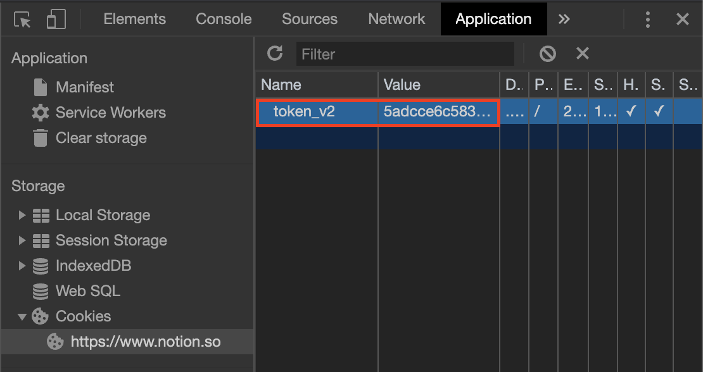
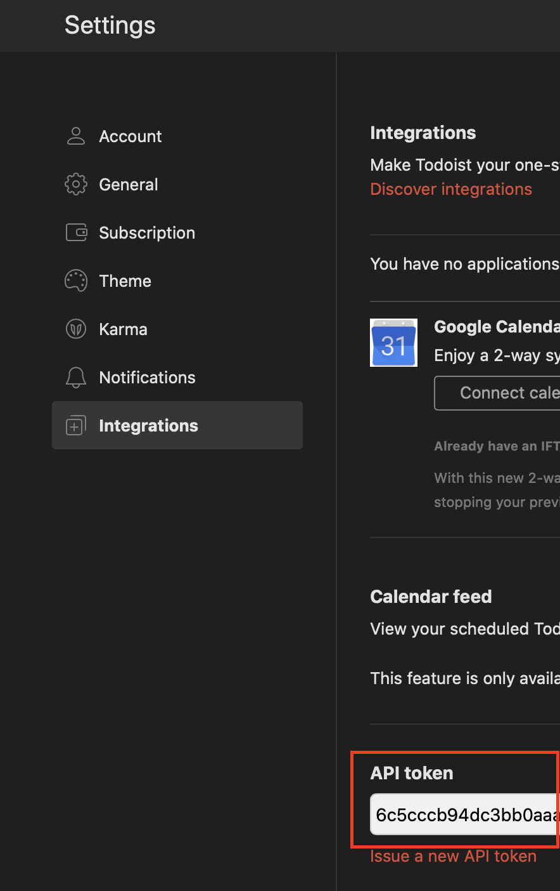

# Notion to Todoist

Python 3 script to migrate to-do lists in Notion to tasks in Todoist.

Makes use of the unofficial [notion-py library](https://github.com/jamalex/notion-py) and official 
[Todoist REST API](https://developer.todoist.com/rest/v1/). 

## Prerequisites

* [Python 3](https://www.python.org/downloads/)
* [pip](https://pypi.org/project/pip/) (included by default with Python versions >= 3.4)
* [venv](https://docs.python.org/3/library/venv.html) (included by default with Python versions >= 3.3)

## Installation

* Create a virtual environment:

```bash
$ python3 -m venv .venv
```
* Activate the virtual environment:

```bash
$ source .venv/bin/activate
```

* Install requirements:

```bash
$ pip install -r requirements.txt
```

## Usage

### Obtaining API Keys

#### Notion

Until Notion releases a public API, the (hacky) way to get an API token is to sign into Notion on a web browser and 
copy the authentication cookie. For example, using Chrome's DevTools:



#### Todoist

Sign into Todoist (browser or native application), navigate to Settings > Integrations and scroll to the bottom:

 

### Configuring

Your `config.yml` file should look similar to:

```yaml
# Notion-specific config
notion:
    user: "blairnangle"
    api_token: "the token you grabbed from your browser"

# Todoist-specific config
todoist:
    api_token: "the token you grabbed from Settings > Integrations"

# Configure migration of a to-do list on a Notion page to tasks in a Todoist project
migration:
    - notion: "Reading-List-2657c435b8654900a1f14850aca28daa"
      todoist: "Reading List"
    - notion: "Shopping-List-24a61811037742894c3a395f9d72ddae"
      todoist: "Shopping List"
```

Notion pages must consist entirely of "To-do list" blocks.

If a project does not already exist for a Todoist project, it will be created.

### Running

To run the script (the virtual environment needs to have been activated using [above instructions](#installation)):

```bash
$ ./execute.py
```

## License

The scripts and documentation in this project are released under the [Apache License, Version 2.0](./LICENSE).
